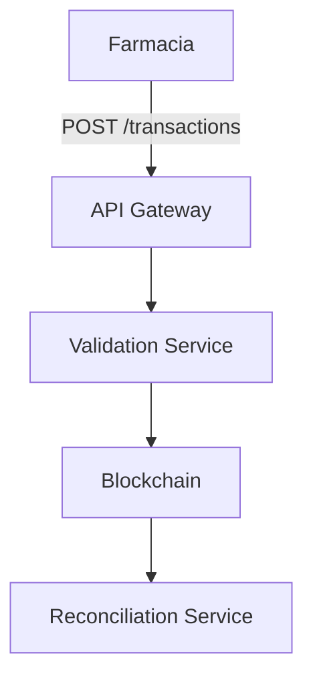
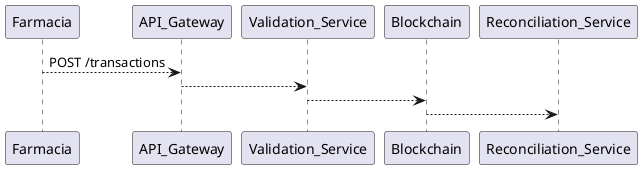

# Guía para Compartir Documentación Farmaclear
## Mejores Prácticas para Presentar al Equipo y Software Factory

---

## 📋 Opciones para Compartir Documentos

### 1. **Repositorio Git (Recomendado para Desarrollo)**

**Ventajas:**
- ✅ Versionado de cambios
- ✅ Colaboración en tiempo real
- ✅ Historial completo
- ✅ Integración con CI/CD
- ✅ Acceso controlado

**Cómo hacerlo:**
```bash
# Crear repositorio privado en GitHub/GitLab
git init
git add FARMACLEAR_*.md
git commit -m "Documentación MVP Farmaclear"
git remote add origin https://github.com/farmaclear/docs-mvp.git
git push -u origin main
```

**Compartir:**
- Invitar colaboradores al repositorio
- Usar GitHub/GitLab Pages para visualización web
- Crear issues para feedback y preguntas

---

### 2. **Notion / Confluence (Recomendado para Equipo)**

**Ventajas:**
- ✅ Interfaz visual atractiva
- ✅ Comentarios y colaboración
- ✅ Búsqueda potente
- ✅ Exportación a PDF
- ✅ Permisos granulares

**Cómo hacerlo:**
1. Crear workspace en Notion
2. Importar documentos Markdown
3. Organizar en páginas jerárquicas
4. Compartir link con el equipo
5. Habilitar comentarios

**Estructura sugerida:**
```
📁 Farmaclear MVP
  ├── 📄 Visión General
  ├── 📁 Arquitectura
  │   ├── Diagramas
  │   └── Especificación Técnica
  ├── 📁 Desarrollo
  │   ├── Timeline
  │   └── Entregables
  └── 📁 Cotización
      └── Documentos para Software Factory
```

---

### 3. **Google Drive / OneDrive (Para Compartir Rápido)**

**Ventajas:**
- ✅ Fácil de compartir
- ✅ Acceso desde cualquier dispositivo
- ✅ Colaboración en tiempo real
- ✅ Historial de versiones

**Cómo hacerlo:**
1. Subir archivos Markdown a Drive
2. Convertir a Google Docs (opcional)
3. Compartir carpeta con permisos
4. Usar comentarios para feedback

**Nota:** Los archivos `.md` se pueden ver directamente en GitHub o usar un visor online.

---

### 4. **Documentación Web (GitBook / MkDocs)**

**Ventajas:**
- ✅ Presentación profesional
- ✅ Navegación intuitiva
- ✅ Búsqueda integrada
- ✅ Responsive (móvil/tablet)
- ✅ Exportación a PDF

**Cómo hacerlo con MkDocs:**

```bash
# Instalar MkDocs
pip install mkdocs mkdocs-material

# Crear estructura
mkdocs new farmaclear-docs
cd farmaclear-docs

# Copiar documentos
cp ../FARMACLEAR_*.md docs/

# Configurar mkdocs.yml
# Ver ejemplo abajo

# Servir localmente
mkdocs serve

# Generar sitio estático
mkdocs build
```

**mkdocs.yml ejemplo:**
```yaml
site_name: Farmaclear MVP Documentation
site_description: Documentación técnica del MVP de Farmaclear
site_author: Farmaclear Team

theme:
  name: material
  palette:
    - scheme: default
      primary: blue
      accent: blue
      toggle:
        icon: material/brightness-7
        name: Switch to dark mode

nav:
  - Inicio: FARMACLEAR_INDEX.md
  - Planificación: FARMACLEAR_MVP_PLANNING.md
  - Diagramas: FARMACLEAR_DIAGRAMS.md
  - Especificación Técnica: FARMACLEAR_TECHNICAL_SPEC.md
  - Timeline: FARMACLEAR_TIMELINE.md

markdown_extensions:
  - pymdownx.highlight
  - pymdownx.superfences
  - pymdownx.tables
```

**Deploy:**
- GitHub Pages (gratis)
- Netlify / Vercel
- Servidor propio

---

### 5. **Presentación Interactiva (Reveal.js / SlideShare)**

**Para reuniones y presentaciones:**

**Reveal.js:**
```bash
# Crear presentación HTML interactiva
npm install -g reveal-md

# Convertir Markdown a presentación
reveal-md FARMACLEAR_MVP_PLANNING.md --theme white
```

**PowerPoint/Google Slides:**
- Crear slides basadas en los documentos
- Incluir diagramas visuales
- Usar para presentaciones ejecutivas

---

## 🎯 Recomendación por Audiencia

### Para **Equipo Interno Farmaclear**
**Opción recomendada:** **Notion** o **Repositorio Git**
- Colaboración diaria
- Comentarios y feedback
- Actualizaciones frecuentes

### Para **Software Factory (Cotización)**
**Opción recomendada:** **Repositorio Git Privado** + **PDF Exportado**
- Acceso controlado
- Versionado claro
- PDF para revisión offline
- Issues para preguntas técnicas

### Para **Stakeholders / Inversores**
**Opción recomendada:** **Presentación PowerPoint** + **Documento Ejecutivo PDF**
- Formato visual
- Resumen ejecutivo
- Diagramas profesionales

---

## 📄 Convertir a PDF

### Opción 1: Pandoc (Recomendado)
```bash
# Instalar Pandoc
# Windows: choco install pandoc
# Mac: brew install pandoc
# Linux: sudo apt-get install pandoc

# Convertir a PDF
pandoc FARMACLEAR_MVP_PLANNING.md -o FARMACLEAR_MVP_PLANNING.pdf \
  --pdf-engine=xelatex \
  -V geometry:margin=1in \
  -V fontsize=11pt \
  --toc
```

### Opción 2: Markdown a PDF (Online)
- [Markdown to PDF](https://www.markdowntopdf.com/)
- [Dillinger](https://dillinger.io/) → Export → PDF
- [StackEdit](https://stackedit.io/) → Export → PDF

### Opción 3: Desde GitHub
1. Abrir archivo `.md` en GitHub
2. Click en "Print" (Ctrl+P)
3. Guardar como PDF

---

## 🔗 Compartir con Software Factory

### Paso 1: Preparar Repositorio
```bash
# Crear repositorio privado
# Agregar todos los documentos
# Crear README con instrucciones
```

### Paso 2: Crear README para Software Factory
```markdown
# Farmaclear MVP - Documentación para Cotización

## 📚 Documentos Disponibles

1. **FARMACLEAR_INDEX.md** - Índice y resumen ejecutivo
2. **FARMACLEAR_MVP_PLANNING.md** - Planificación completa
3. **FARMACLEAR_DIAGRAMS.md** - Diagramas técnicos
4. **FARMACLEAR_TECHNICAL_SPEC.md** - Especificación técnica
5. **FARMACLEAR_TIMELINE.md** - Timeline y entregables

## 🎯 Objetivo

Desarrollar MVP Fase 1 del sistema de clearing farmacéutico.

## 📅 Timeline Estimado

10 semanas (Febrero - Abril 2026)

## ❓ Preguntas

Usar GitHub Issues para preguntas técnicas.

## 📞 Contacto

- Equipo multidisciplinario disponible para consultas
```

### Paso 3: Invitar al Repositorio
1. Ir a Settings → Collaborators
2. Agregar usuarios de Software Factory
3. Dar acceso de lectura
4. Habilitar Issues para preguntas

### Paso 4: Crear Issue Template
```markdown
## Pregunta Técnica

**Documento:** [Especificar documento]
**Sección:** [Especificar sección]
**Pregunta:** [Tu pregunta]

## Contexto

[Contexto adicional si es necesario]
```

---

## 📊 Crear Diagramas Visuales

Los diagramas en texto pueden convertirse a visuales:

### Opción 1: Mermaid.js (Integrado en GitHub/GitLab)
```markdown

```

### Opción 2: Draw.io / Lucidchart
1. Abrir [draw.io](https://app.diagrams.net/)
2. Crear nuevo diagrama
3. Replicar diagramas de texto
4. Exportar como PNG/PDF
5. Agregar a documentación

### Opción 3: PlantUML


---

## 🎨 Mejoras Visuales

### Agregar Badges (GitHub)
```markdown


```

### Agregar Tablas de Contenido
```markdown
## Tabla de Contenidos
- [Sección 1](#sección-1)
- [Sección 2](#sección-2)
```

### Usar Emojis (Ya incluidos)
- ✅ Para completado
- 🔄 Para procesos
- 📅 Para fechas
- ⚠️ Para advertencias

---

## 📧 Email de Presentación (Ejemplo)

```
Asunto: Farmaclear MVP - Documentación Técnica para Cotización

Hola [Equipo Software Factory],

Les comparto la documentación técnica completa del MVP de Farmaclear 
para que puedan preparar la cotización.

📚 Documentación disponible en:
[Link al repositorio o Notion]

📋 Documentos incluidos:
1. Índice y resumen ejecutivo
2. Planificación completa del proyecto
3. Diagramas técnicos detallados
4. Especificación técnica MVP Fase 1
5. Timeline y entregables

🎯 Objetivo:
Desarrollar MVP Fase 1 (10 semanas) del sistema de clearing 
farmacéutico para Chile.

📅 Timeline propuesto:
- Inicio: Febrero 2026
- Fin: Abril 2026

❓ Preguntas:
Pueden usar [GitHub Issues / Notion Comments] para cualquier 
pregunta técnica.

📞 Contacto:
- Equipo Farmaclear - Usar Issues en GitHub para consultas

Esperamos su cotización detallada.

Saludos,
Equipo Farmaclear
```

---

## ✅ Checklist para Compartir

- [ ] Todos los documentos están completos
- [ ] Diagramas están claros y legibles
- [ ] Links internos funcionan
- [ ] Repositorio/configuración lista
- [ ] Permisos de acceso configurados
- [ ] README con instrucciones creado
- [ ] Email de presentación enviado
- [ ] Canal de comunicación establecido (Issues/Slack)

---

## 🚀 Quick Start - Setup Rápido

### Para Compartir con Software Factory (5 minutos):

```bash
# 1. Crear repositorio en GitHub
# 2. Subir documentos
git init
git add FARMACLEAR_*.md
git commit -m "Documentación MVP Farmaclear"
git remote add origin [URL_REPO]
git push -u origin main

# 3. Invitar colaboradores
# 4. Crear README.md con instrucciones
# 5. Compartir link
```

### Para Presentación al Equipo (10 minutos):

1. Abrir Notion
2. Crear nueva página "Farmaclear MVP"
3. Importar documentos Markdown
4. Organizar en secciones
5. Compartir link con el equipo

---

**Recomendación Final:**
- **Repositorio Git** para Software Factory (profesional, versionado)
- **Notion** para equipo interno (colaboración, comentarios)
- **PDF** para presentaciones ejecutivas (portable, offline)

---

**Fecha:** Enero 2026
