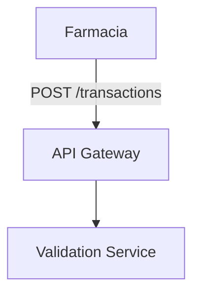

# Herramientas Recomendadas para Documentación Farmaclear
## Soluciones Profesionales, Visuales y Colaborativas

---

## 🏆 Recomendación Principal: **Notion**

### ¿Por qué Notion?
- ✅ **Visual y profesional** - Interfaz moderna y atractiva
- ✅ **Colaborativo** - Múltiples editores en tiempo real
- ✅ **Importa Markdown** - Puedes pegar directamente tus archivos `.md`
- ✅ **Gratis** para equipos pequeños
- ✅ **Compartible** - Links públicos o privados
- ✅ **Búsqueda potente** - Encuentra cualquier cosa rápidamente
- ✅ **Exporta a PDF** - Para presentaciones offline
- ✅ **Móvil** - App iOS/Android

### Setup Rápido (10 minutos)

1. **Crear cuenta:** https://www.notion.so
2. **Crear Workspace:** "Farmaclear MVP"
3. **Importar documentos:**
   - Click en "+" → "Import"
   - Seleccionar archivos `.md` o copiar/pegar contenido
4. **Organizar estructura:**
   ```
   📁 Farmaclear MVP
     ├── 📄 Índice General
     ├── 📁 1. Planificación
     │   └── FARMACLEAR_MVP_PLANNING.md
     ├── 📁 2. Diagramas
     │   └── FARMACLEAR_DIAGRAMS.md
     ├── 📁 3. Especificación Técnica
     │   └── FARMACLEAR_TECHNICAL_SPEC.md
     ├── 📁 4. Timeline
     │   └── FARMACLEAR_TIMELINE.md
     └── 📁 5. Cotización
         └── Documentos para Software Factory
   ```
5. **Compartir:**
   - Click en "Share" → Agregar emails o generar link
   - Configurar permisos (Can edit / Can view)

### Ventajas para tu caso:
- **Diagramas:** Puedes crear diagramas visuales directamente en Notion
- **Tablas:** Excelentes para timelines y entregables
- **Comentarios:** El equipo puede comentar secciones específicas
- **Templates:** Reutilizar estructura para futuros proyectos

### Precio:
- **Gratis:** Hasta 10 miembros
- **Plus:** $8/mes por usuario (más funciones)

---

## 🥈 Alternativa Empresarial: **Confluence**

### ¿Cuándo usar Confluence?
- Si ya usas Atlassian (Jira, etc.)
- Necesitas integración con herramientas empresariales
- Requieres permisos avanzados y auditoría

### Setup:
1. Crear espacio en Confluence
2. Importar documentos Markdown
3. Usar macros para diagramas
4. Configurar permisos por página

### Precio:
- **Free:** Hasta 10 usuarios
- **Standard:** $5.75/mes por usuario

---

## 🥉 Para Documentación Técnica: **GitBook**

### ¿Cuándo usar GitBook?
- Documentación técnica pura
- Necesitas versión web pública
- Quieres integración con Git

### Setup:
1. Crear cuenta en GitBook
2. Conectar repositorio Git (opcional)
3. Importar documentos
4. Personalizar tema
5. Publicar

### Ventajas:
- **Navegación automática** - Tabla de contenidos generada
- **Búsqueda avanzada** - Full-text search
- **Versionado** - Historial de cambios
- **API** - Integración programática

### Precio:
- **Free:** Documentación pública
- **Pro:** $6.50/mes por usuario (privada)

---

## 🎨 Para Diagramas Visuales: **Miro** o **Lucidchart**

### Miro (Recomendado para colaboración)
- ✅ Tableros infinitos
- ✅ Colaboración en tiempo real
- ✅ Templates profesionales
- ✅ Integración con Notion/Slack

**Setup:**
1. Crear cuenta en Miro
2. Crear nuevo board "Farmaclear Architecture"
3. Importar diagramas o recrearlos visualmente
4. Compartir con equipo

**Precio:**
- **Free:** 3 boards
- **Team:** $8/mes por usuario

### Lucidchart (Más profesional)
- ✅ Diagramas técnicos avanzados
- ✅ Exportación a múltiples formatos
- ✅ Integración con Confluence/Google Docs

**Precio:**
- **Free:** Limitado
- **Individual:** $7.95/mes

---

## 📊 Comparación Rápida

| Característica | Notion | Confluence | GitBook | Miro |
|----------------|--------|------------|---------|------|
| **Visual** | ⭐⭐⭐⭐⭐ | ⭐⭐⭐⭐ | ⭐⭐⭐⭐ | ⭐⭐⭐⭐⭐ |
| **Colaboración** | ⭐⭐⭐⭐⭐ | ⭐⭐⭐⭐⭐ | ⭐⭐⭐ | ⭐⭐⭐⭐⭐ |
| **Markdown** | ✅ | ✅ | ✅ | ❌ |
| **Diagramas** | ⭐⭐⭐ | ⭐⭐⭐ | ⭐⭐ | ⭐⭐⭐⭐⭐ |
| **Precio** | Gratis/Barato | Medio | Barato | Gratis/Barato |
| **Fácil setup** | ⭐⭐⭐⭐⭐ | ⭐⭐⭐ | ⭐⭐⭐⭐ | ⭐⭐⭐⭐ |

---

## 🚀 Setup Completo Recomendado

### Stack Ideal para Farmaclear:

```
┌─────────────────────────────────────┐
│         NOTION (Principal)           │
│  - Documentación completa            │
│  - Colaboración diaria               │
│  - Compartir con Software Factory   │
└─────────────────────────────────────┘
              │
              ├───► Exportar PDFs para presentaciones
              │
              └───► Compartir links para revisión
```

**Complementos:**
- **Miro** - Para diagramas de arquitectura visuales
- **GitHub** - Para versionado de código y docs técnicas
- **Slack** - Para comunicación del equipo

---

## 📝 Guía Paso a Paso: Setup en Notion

### Paso 1: Crear Workspace
1. Ir a https://www.notion.so
2. Sign up con email
3. Crear nuevo workspace "Farmaclear"

### Paso 2: Importar Documentos
1. Click en "+" en sidebar izquierdo
2. Seleccionar "Import"
3. Elegir "Markdown & CSV"
4. Subir archivos `FARMACLEAR_*.md`
5. Notion los convertirá automáticamente

### Paso 3: Organizar Estructura
```
📄 Farmaclear MVP Documentation
  ├── 📄 README - Índice General
  ├── 📁 1. Planificación
  │   ├── 📄 Visión General
  │   ├── 📄 Arquitectura
  │   └── 📄 Flujos de Datos
  ├── 📁 2. Diagramas
  │   ├── 📄 Arquitectura de Alto Nivel
  │   ├── 📄 Flujos de Transacciones
  │   └── 📄 Modelo de Datos
  ├── 📁 3. Especificación Técnica
  │   ├── 📄 Requisitos Funcionales
  │   ├── 📄 Stack Tecnológico
  │   └── 📄 APIs y Contratos
  ├── 📁 4. Timeline y Entregables
  │   ├── 📄 Timeline General
  │   └── 📄 Entregables por Fase
  └── 📁 5. Cotización
      └── 📄 Documentos para Software Factory
```

### Paso 4: Mejorar Visualmente

**Agregar Iconos:**
- Usar emojis: 📋 📊 🏗️ 🔄
- O iconos de Notion: `/icon` → buscar

**Agregar Callouts:**
```
/callout
⚠️ Importante: ...
✅ Completado: ...
💡 Nota: ...
```

**Agregar Tablas:**
- `/table` para crear tablas interactivas
- Perfecto para timelines y entregables

**Agregar Toggle Lists:**
- `/toggle` para secciones colapsables
- Útil para detalles técnicos

### Paso 5: Crear Diagramas Visuales

**Opción 1: Mermaid en Notion**


**Opción 2: Embed Miro**
1. Crear diagrama en Miro
2. En Notion: `/embed` → pegar link de Miro
3. Se mostrará interactivo

**Opción 3: Imágenes**
- Crear en Draw.io/Lucidchart
- Exportar PNG/SVG
- Subir a Notion

### Paso 6: Compartir

**Con Software Factory:**
1. Click en "Share" (arriba derecha)
2. Agregar emails o generar link
3. Permisos: "Can view" o "Can edit"
4. Copiar link y enviar

**Con Equipo Interno:**
1. Agregar miembros al workspace
2. Dar permisos de edición
3. Usar comentarios para feedback

---

## 🎨 Templates Útiles para Notion

### Template: Documento Técnico
```
# [Título]
**Versión:** 1.0  
**Fecha:** [Fecha]  
**Autor:** [Nombre]

## Objetivo
[Descripción]

## Contenido
[Contenido con callouts, tablas, etc.]

## Referencias
- [Link 1]
- [Link 2]
```

### Template: Timeline
```
## Timeline MVP Fase 1

| Semana | Fase | Entregables | Estado |
|--------|------|-------------|--------|
| 1-2 | Setup | Repositorio, Docker | ⏳ |
| 3-5 | Backend | APIs, Servicios | ⏳ |
| 6-7 | Frontend | Dashboards | ⏳ |
```

---

## 🔄 Workflow Recomendado

### Para Desarrollo:
1. **Escribir** en Markdown localmente (VS Code)
2. **Copiar** a Notion para visualización
3. **Colaborar** en Notion con comentarios
4. **Exportar** PDFs cuando necesario
5. **Versionar** en Git para historial

### Para Presentaciones:
1. **Preparar** en Notion con formato visual
2. **Exportar** a PDF
3. **Crear** slides en PowerPoint/Google Slides
4. **Incluir** diagramas de Miro

---

## 💡 Tips Pro

### Notion:
- Usa `/` para acceder rápido a comandos
- Crea templates reutilizables
- Usa databases para gestionar entregables
- Conecta con Slack para notificaciones

### Miro:
- Usa templates de arquitectura
- Colabora en tiempo real
- Exporta a PNG/PDF para documentos
- Integra con Notion via embed

### GitBook:
- Conecta con GitHub para auto-sync
- Usa custom domain para branding
- Configura SEO para documentación pública

---

## 📦 Setup Completo (30 minutos)

### 1. Notion (15 min)
- ✅ Crear cuenta
- ✅ Importar documentos
- ✅ Organizar estructura
- ✅ Agregar iconos y formato

### 2. Miro (10 min)
- ✅ Crear cuenta
- ✅ Crear board "Farmaclear Architecture"
- ✅ Recrear diagramas principales
- ✅ Compartir con equipo

### 3. GitHub (5 min)
- ✅ Crear repositorio privado
- ✅ Subir documentos `.md`
- ✅ Configurar README
- ✅ Invitar colaboradores

---

## 🎯 Recomendación Final

**Para Farmaclear, usa:**

1. **Notion** como herramienta principal
   - Documentación completa
   - Colaboración con Software Factory
   - Fácil de compartir y editar

2. **Miro** para diagramas visuales
   - Arquitectura de sistema
   - Flujos de procesos
   - Presentaciones

3. **GitHub** para versionado
   - Historial de cambios
   - Backup de documentos
   - Integración con desarrollo

**Costo total:** $0 (plan gratuito de todas las herramientas)

---

## 🚀 Quick Start (5 minutos)

1. **Ir a Notion:** https://www.notion.so
2. **Crear cuenta** (gratis)
3. **Crear workspace** "Farmaclear"
4. **Importar** archivos `.md`:
   - Click "+" → Import → Markdown
   - Seleccionar `FARMACLEAR_*.md`
5. **Compartir:**
   - Click "Share" → Agregar emails
   - O generar link público

**¡Listo!** Ya tienes documentación profesional y colaborativa.

---

**¿Necesitas ayuda con el setup?** 
- Guía detallada paso a paso disponible
- Templates listos para usar
- Ejemplos visuales incluidos

---

**Creado por:** Manuel Astaburuaga  
**Fecha:** Enero 2026
