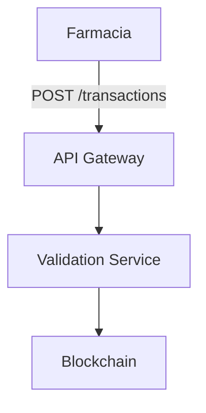

# GitHub para Documentación Farmaclear
## Guía Completa: Ventajas, Limitaciones y Setup

---

## ✅ ¿GitHub Sirve para Documentación?

**Sí, pero con matices:**

### ✅ Excelente para:
- **Versionado** - Historial completo de cambios
- **Colaboración técnica** - Pull requests, reviews
- **Markdown nativo** - Renderiza perfectamente
- **Issues** - Para preguntas y tracking
- **Profesional** - Estándar en la industria tech
- **Gratis** - Repositorios privados ilimitados
- **Integración** - Con CI/CD, herramientas dev

### ⚠️ Limitaciones:
- **Menos visual** - No tan bonito como Notion
- **Menos colaborativo** - No edición en tiempo real
- **Curva de aprendizaje** - Git puede ser complejo
- **No móvil-friendly** - App móvil limitada

---

## 🎯 ¿Cuándo Usar GitHub?

### ✅ Ideal para:
1. **Documentación técnica** que necesita versionado
2. **Compartir con Software Factory** (estándar en la industria)
3. **Tracking de cambios** y historial
4. **Integración con desarrollo** futuro
5. **Documentación que cambia frecuentemente**

### ❌ No ideal para:
1. **Presentaciones visuales** ejecutivas
2. **Colaboración no-técnica** (stakeholders)
3. **Edición rápida** sin Git
4. **Documentación muy visual** (diagramas interactivos)

---

## 🚀 Setup GitHub para Documentación

### Opción 1: Repositorio de Documentación (Recomendado)

```bash
# 1. Crear repositorio en GitHub
#    - Nombre: farmaclear-mvp-docs
#    - Privado: ✅
#    - Agregar README: ✅

# 2. Clonar localmente
git clone https://github.com/tu-usuario/farmaclear-mvp-docs.git
cd farmaclear-mvp-docs

# 3. Agregar documentos
git add FARMACLEAR_*.md
git commit -m "Documentación MVP Farmaclear"
git push origin main

# 4. Configurar GitHub Pages (opcional)
#    Settings → Pages → Source: main branch
```

### Opción 2: GitHub Wiki

```bash
# 1. En tu repositorio, click "Wiki"
# 2. Crear páginas directamente en GitHub
# 3. Usar Markdown
# 4. Automáticamente versionado
```

### Opción 3: GitHub Pages (Sitio Web)

```bash
# 1. Crear carpeta docs/
# 2. Agregar index.md
# 3. Configurar Pages en Settings
# 4. Acceso: https://tu-usuario.github.io/farmaclear-docs
```

---

## 📋 Estructura Recomendada en GitHub

```
farmaclear-mvp-docs/
├── README.md                    # Índice principal
├── FARMACLEAR_INDEX.md          # Índice detallado
├── FARMACLEAR_MVP_PLANNING.md   # Planificación
├── FARMACLEAR_DIAGRAMS.md       # Diagramas
├── FARMACLEAR_TECHNICAL_SPEC.md # Especificación técnica
├── FARMACLEAR_TIMELINE.md       # Timeline
├── FARMACLEAR_SHARING_GUIDE.md  # Guía de compartir
├── .github/
│   ├── ISSUE_TEMPLATE/          # Templates para preguntas
│   │   ├── pregunta-tecnica.md
│   │   └── bug-report.md
│   └── workflows/               # CI/CD (opcional)
└── docs/
    └── assets/                  # Imágenes, diagramas
```

---

## 🎨 Mejorar Visualización en GitHub

### 1. README.md Profesional

```markdown
# 🏥 Farmaclear MVP Documentation


## 📚 Documentación

- [📋 Índice General](./FARMACLEAR_INDEX.md)
- [📊 Planificación Completa](./FARMACLEAR_MVP_PLANNING.md)
- [📐 Diagramas Técnicos](./FARMACLEAR_DIAGRAMS.md)
- [⚙️ Especificación Técnica](./FARMACLEAR_TECHNICAL_SPEC.md)
- [📅 Timeline y Entregables](./FARMACLEAR_TIMELINE.md)

## 🎯 Objetivo

Sistema de clearing farmacéutico para Chile.

## 📞 Contacto

- Equipo multidisciplinario disponible para consultas
```

### 2. Usar Diagramas Mermaid (Nativo en GitHub)

```markdown

```

**Ventaja:** GitHub renderiza Mermaid automáticamente.

### 3. Tablas Profesionales

```markdown
| Semana | Fase | Entregables | Estado |
|--------|------|-------------|--------|
| 1-2 | Setup | Repositorio | ⏳ |
| 3-5 | Backend | APIs | ⏳ |
```

### 4. Badges y Shields

```markdown


```

---

## 🔗 Compartir con Software Factory

### Paso 1: Crear Repositorio Privado

1. Ir a GitHub.com
2. Click "New repository"
3. Nombre: `farmaclear-mvp-docs`
4. Privado: ✅
5. Agregar README: ✅
6. Crear repositorio

### Paso 2: Subir Documentos

```bash
git clone https://github.com/tu-usuario/farmaclear-mvp-docs.git
cd farmaclear-mvp-docs

# Copiar documentos
cp ../FARMACLEAR_*.md .

# Commit y push
git add .
git commit -m "Documentación MVP Farmaclear"
git push origin main
```

### Paso 3: Invitar Colaboradores

1. Settings → Collaborators
2. "Add people"
3. Agregar emails de Software Factory
4. Permisos: "Write" (pueden hacer pull requests)

### Paso 4: Configurar Issues para Preguntas

Crear `.github/ISSUE_TEMPLATE/pregunta-tecnica.md`:

```markdown
---
name: Pregunta Técnica
about: Pregunta sobre documentación o especificación
title: '[PREGUNTA] '
labels: question
assignees: ''
---

## Documento
[Especificar documento y sección]

## Pregunta
[Tu pregunta detallada]

## Contexto
[Contexto adicional si es necesario]
```

---

## 📊 GitHub Pages (Sitio Web Profesional)

### Setup Rápido:

```bash
# 1. Crear carpeta docs/
mkdir docs
cd docs

# 2. Crear index.md
cat > index.md << EOF
# Farmaclear MVP Documentation

## Documentos

- [Planificación](./FARMACLEAR_MVP_PLANNING.md)
- [Diagramas](./FARMACLEAR_DIAGRAMS.md)
- [Especificación Técnica](./FARMACLEAR_TECHNICAL_SPEC.md)
EOF

# 3. Mover documentos a docs/
mv ../FARMACLEAR_*.md .

# 4. Commit
git add .
git commit -m "Setup GitHub Pages"
git push origin main
```

### Configurar Pages:

1. Settings → Pages
2. Source: Deploy from branch
3. Branch: `main` / `docs`
4. Save
5. Acceso: `https://tu-usuario.github.io/farmaclear-mvp-docs`

**Ventaja:** Sitio web navegable y profesional.

---

## 🎨 Mejorar con Jekyll (GitHub Pages)

### Crear `_config.yml`:

```yaml
title: Farmaclear MVP Documentation
description: Documentación técnica del MVP de Farmaclear
theme: jekyll-theme-minimal

navigation:
  - title: Inicio
    url: /
  - title: Planificación
    url: /FARMACLEAR_MVP_PLANNING.html
  - title: Diagramas
    url: /FARMACLEAR_DIAGRAMS.html
  - title: Especificación Técnica
    url: /FARMACLEAR_TECHNICAL_SPEC.html
```

**Resultado:** Sitio web profesional con navegación.

---

## 🔄 Workflow Recomendado

### Para Documentación Técnica:

```
1. Escribir en Markdown (localmente)
2. Commit a GitHub
3. Software Factory hace Pull Request con preguntas
4. Revisar y responder
5. Merge cambios
```

### Para Colaboración:

```
1. Crear Issue para cada pregunta/duda
2. Usar Labels para categorizar
3. Asignar responsables
4. Cerrar cuando resuelto
```

---

## 📱 Acceso Móvil

### GitHub Mobile App:
- ✅ Ver documentos
- ✅ Ver Issues
- ⚠️ Edición limitada
- ❌ No tan cómodo como Notion

---

## 💡 Comparación: GitHub vs Notion

| Característica | GitHub | Notion |
|----------------|--------|--------|
| **Versionado** | ⭐⭐⭐⭐⭐ | ⭐⭐ |
| **Visual** | ⭐⭐⭐ | ⭐⭐⭐⭐⭐ |
| **Colaboración técnica** | ⭐⭐⭐⭐⭐ | ⭐⭐⭐ |
| **Edición fácil** | ⭐⭐ | ⭐⭐⭐⭐⭐ |
| **Móvil** | ⭐⭐ | ⭐⭐⭐⭐⭐ |
| **Gratis** | ✅ | ✅ |
| **Estándar industria** | ✅ | ⚠️ |
| **Markdown nativo** | ✅ | ✅ |

---

## 🎯 Recomendación: Stack Híbrido

### Mejor Combinación:

```
┌─────────────────────────────────┐
│      GITHUB (Principal)         │
│  - Documentación técnica        │
│  - Versionado                   │
│  - Issues para preguntas        │
│  - Compartir con Software Factory│
└─────────────────────────────────┘
              │
              ├───► GitHub Pages (Sitio web)
              │
              └───► Exportar PDFs cuando necesario
```

**Complemento opcional:**
- **Notion** - Para presentaciones visuales
- **Miro** - Para diagramas interactivos

---

## ✅ Checklist Setup GitHub

- [ ] Repositorio creado (privado)
- [ ] Documentos subidos
- [ ] README.md profesional creado
- [ ] Issues templates configurados
- [ ] Colaboradores invitados
- [ ] GitHub Pages configurado (opcional)
- [ ] Link compartido con Software Factory

---

## 🚀 Quick Start GitHub (5 minutos)

```bash
# 1. Crear repositorio en GitHub.com
#    - Nombre: farmaclear-mvp-docs
#    - Privado: ✅

# 2. Clonar y subir documentos
git clone https://github.com/tu-usuario/farmaclear-mvp-docs.git
cd farmaclear-mvp-docs
cp ../FARMACLEAR_*.md .
git add .
git commit -m "Documentación MVP"
git push origin main

# 3. Invitar colaboradores
#    Settings → Collaborators → Add people

# 4. Compartir link
#    https://github.com/tu-usuario/farmaclear-mvp-docs
```

---

## 📝 Template README.md

He creado un template completo en el siguiente archivo. Puedes copiarlo directamente.

---

## 🎯 Conclusión

**GitHub es excelente para:**
- ✅ Documentación técnica profesional
- ✅ Compartir con Software Factory (estándar industria)
- ✅ Versionado y tracking de cambios
- ✅ Issues para preguntas técnicas

**Combina con:**
- Notion para presentaciones visuales
- Miro para diagramas interactivos
- GitHub Pages para sitio web

---

**¿Quieres que te ayude a configurarlo?** Puedo crear el README.md profesional y la estructura completa.

---

**Fecha:** Enero 2026
