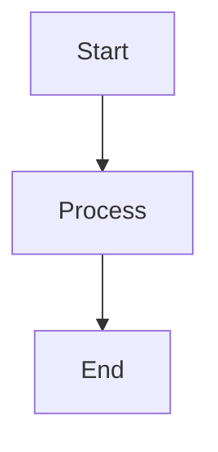

# Quick Start: Setup Notion en 10 Minutos
## Guía Rápida para Documentación Farmaclear

---

## ⚡ Setup Rápido (10 minutos)

### Paso 1: Crear Cuenta (2 min)
1. Ir a https://www.notion.so
2. Click "Sign up" → Usar email o Google
3. Crear workspace "Farmaclear"

### Paso 2: Importar Documentos (3 min)

**Opción A: Importar archivos .md**
1. Click "+" en sidebar izquierdo
2. Seleccionar "Import"
3. Elegir "Markdown & CSV"
4. Subir todos los archivos `FARMACLEAR_*.md`
5. Notion los convertirá automáticamente

**Opción B: Copiar/Pegar contenido**
1. Abrir archivo `.md` en editor
2. Copiar todo el contenido
3. En Notion, pegar directamente
4. Notion formateará automáticamente

### Paso 3: Organizar (2 min)

Crear estructura:
```
📄 Farmaclear MVP
  ├── 📄 Índice General
  ├── 📁 Planificación
  ├── 📁 Diagramas
  ├── 📁 Especificación Técnica
  ├── 📁 Timeline
  └── 📁 Cotización
```

**Cómo hacerlo:**
- Click en página → "/" → "Page" → Crear subpágina
- Arrastrar páginas para reorganizar

### Paso 4: Mejorar Visualmente (2 min)

**Agregar iconos:**
- Click en icono de página → Elegir emoji o icono

**Agregar callouts importantes:**
- Escribir `/callout` → Elegir tipo (⚠️ ⚡ 💡 ✅)

**Agregar tablas:**
- Escribir `/table` → Crear tabla interactiva

### Paso 5: Compartir (1 min)

**Con Software Factory:**
1. Click "Share" (arriba derecha)
2. Click "Add people" → Agregar emails
3. O generar link público
4. Configurar permisos: "Can view" o "Can edit"

---

## 🎨 Formato Profesional

### Headers y Estructura
```
# Título Principal
## Subtítulo
### Sub-subtítulo
```

### Callouts Importantes
```
/callout
⚠️ **Importante:** Este es un punto crítico
```

### Tablas Interactivas
```
/table
| Columna 1 | Columna 2 | Estado |
|-----------|-----------|--------|
| Item 1    | Valor 1   | ✅     |
```

### Listas con Checkboxes
```
- [ ] Tarea pendiente
- [x] Tarea completada
```

### Código
```
/code
```typescript
interface Example {
  field: string;
}
```
```

---

## 📊 Crear Diagramas en Notion

### Opción 1: Mermaid (Integrado)


**Cómo:**
1. Escribir `/code`
2. Seleccionar lenguaje "Mermaid"
3. Pegar código del diagrama

### Opción 2: Embed Miro
1. Crear diagrama en Miro
2. En Notion: `/embed`
3. Pegar link de Miro
4. Se mostrará interactivo

### Opción 3: Imagen
1. Crear diagrama en Draw.io/Lucidchart
2. Exportar PNG/SVG
3. En Notion: `/image` → Subir

---

## 🔗 Compartir con Equipo

### Link Público
1. Click "Share"
2. Activar "Share to web"
3. Copiar link
4. Compartir con quien quieras

### Invitar por Email
1. Click "Share"
2. "Add people"
3. Agregar emails
4. Elegir permisos:
   - **Can edit** - Pueden modificar
   - **Can view** - Solo lectura
   - **Can comment** - Pueden comentar

### Permisos Granulares
- Por página individual
- Por workspace completo
- Por grupo de páginas

---

## 📱 Acceso Móvil

### App iOS/Android
1. Descargar app Notion
2. Login con misma cuenta
3. Acceso completo desde móvil

### Ventajas:
- ✅ Ver documentos offline
- ✅ Editar desde cualquier lugar
- ✅ Notificaciones de cambios
- ✅ Compartir fácilmente

---

## 💾 Exportar a PDF

### Para Presentaciones
1. Click "..." (tres puntos arriba derecha)
2. "Export"
3. Seleccionar "PDF"
4. Descargar

### Ventajas:
- ✅ Formato profesional
- ✅ Mantiene formato visual
- ✅ Compartible offline
- ✅ Imprimible

---

## 🎯 Tips Pro

### Atajos de Teclado
- `/` - Menú de comandos rápido
- `Ctrl/Cmd + B` - Negrita
- `Ctrl/Cmd + I` - Itálica
- `Ctrl/Cmd + K` - Crear link

### Templates
- Crear página template
- Duplicar para nuevos documentos
- Mantener consistencia

### Databases
- Usar para gestionar entregables
- Filtros y vistas personalizadas
- Tracking de progreso

---

## ✅ Checklist Setup

- [ ] Cuenta Notion creada
- [ ] Workspace "Farmaclear" creado
- [ ] Documentos importados
- [ ] Estructura organizada
- [ ] Iconos y formato aplicado
- [ ] Link de compartir generado
- [ ] Equipo invitado (opcional)
- [ ] PDFs exportados (opcional)

---

## 🆘 Problemas Comunes

### Los documentos no se ven bien
- **Solución:** Revisar formato Markdown
- Notion puede necesitar ajustes manuales

### No puedo compartir
- **Solución:** Verificar permisos del workspace
- Asegurar que "Share to web" está activado

### Los diagramas no se muestran
- **Solución:** Usar embed de Miro o subir como imagen
- Mermaid puede requerir formato específico

---

## 🚀 Siguiente Paso

Una vez configurado Notion:
1. Compartir link con Software Factory
2. Agregar comentarios para feedback
3. Usar para colaboración diaria
4. Exportar PDFs cuando necesario

---

**¿Listo?** ¡Empieza ahora en https://www.notion.so!

---

**Fecha:** Enero 2026
