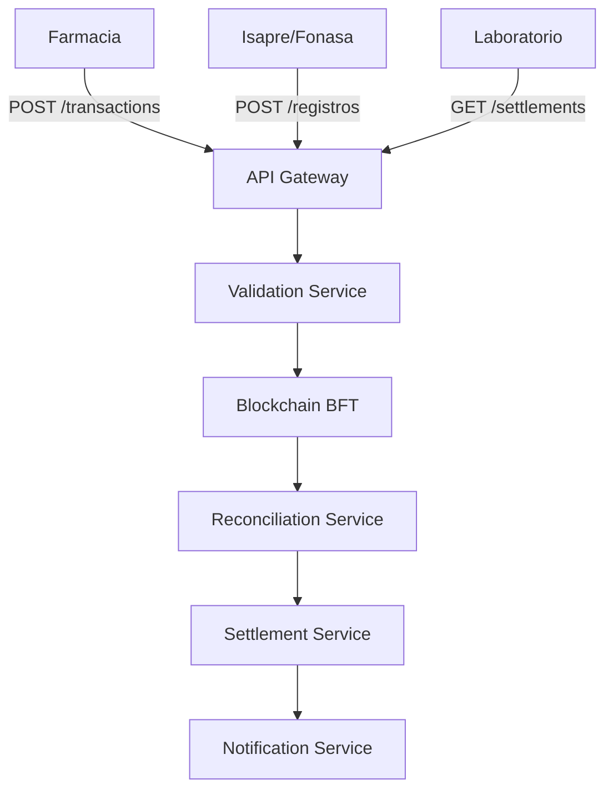

# 🏥 Farmaclear MVP Documentation

> Sistema de Clearing Farmacéutico para Chile - Documentación Técnica MVP Fase 1

---

## 📚 Documentación Disponible

| Documento | Descripción | Link |
|-----------|-------------|------|
| 📋 **Índice General** | Resumen ejecutivo y navegación | [Ver](./FARMACLEAR_INDEX.md) |
| 📊 **Planificación Completa** | Arquitectura, flujos y modelo de negocio | [Ver](./FARMACLEAR_MVP_PLANNING.md) |
| 📐 **Diagramas Técnicos** | Diagramas de arquitectura y flujos | [Ver](./FARMACLEAR_DIAGRAMS.md) |
| ⚙️ **Especificación Técnica** | Requisitos funcionales y stack tecnológico | [Ver](./FARMACLEAR_TECHNICAL_SPEC.md) |
| 📅 **Timeline y Entregables** | Planificación temporal detallada | [Ver](./FARMACLEAR_TIMELINE.md) |
| 🔗 **Guía de Compartir** | Cómo compartir documentación | [Ver](./FARMACLEAR_SHARING_GUIDE.md) |

---

## 🎯 Objetivo del MVP

Desarrollar un sistema de clearing farmacéutico que permita:

- ✅ **Validar** transacciones GES (hard-coded para MVP)
- 🔄 **Conciliar** descuentos entre actores automáticamente
- 📅 **Liquidar** pagos de forma estandarizada
- ☑ **Auditar** y trazar todas las transacciones en blockchain

---

## 🏗️ Arquitectura del Sistema

---

## 👥 Actores del Sistema

1. **Cadenas de Farmacias** (FASA, Cruz Verde, Salcobrand, Simi)
2. **Farmacias Independientes**
3. **Laboratorios Farmacéuticos**
4. **Isapres** (Instituciones de Salud Previsional)
5. **Fonasa** (Fondo Nacional de Salud)
6. **Farmaclear** (Plataforma - Operador Neutral)

---

## 🛠️ Stack Tecnológico

- **Backend:** Node.js + TypeScript + Express/NestJS
- **Frontend:** React + TypeScript + shadcn/ui
- **Base de Datos:** PostgreSQL + Redis
- **Blockchain:** Hyperledger Fabric / Cosmos SDK (BFT 3 nodos)
- **Infraestructura:** Docker + Kubernetes

---

## 📅 Timeline MVP Fase 1

| Fase | Semanas | Entregables |
|------|---------|-------------|
| **Setup y Arquitectura** | 1-2 | Repositorio, Docker, DB |
| **Backend Core** | 3-5 | APIs, Servicios, Blockchain |
| **Frontend** | 6-7 | Dashboards por actor |
| **Integración y Testing** | 8 | Tests E2E, Optimización |
| **Documentación y Deployment** | 9-10 | Docs completa, Producción |

**Duración total:** 10 semanas  
**Inicio propuesto:** Febrero 2026  
**Fin estimado:** Abril 2026

---

## ✅ Alcance MVP Fase 1

### Incluye:
- ✅ APIs REST completas
- ✅ Validación de transacciones GES (hard-coded)
- ✅ Conciliación automática (simulada)
- ✅ Dashboards por actor
- ✅ Integración blockchain básica
- ✅ Sistema de notificaciones básico

### No incluye:
- ❌ Integración con sistemas externos reales
- ❌ Procesamiento de pagos bancarios
- ❌ Reportes avanzados
- ❌ Mobile apps

---

## 📞 Contacto

**Equipo Farmaclear:**
- **Manuel Astaburuaga** - Tecnología (Tech Lead)
- **Victor Pucci** - Estrategia Negocio (Product Owner)
- **Daniel Horán** - Advisor Industria Farma

---

## ❓ Preguntas y Feedback

Para preguntas técnicas o feedback sobre la documentación:

1. **Crear Issue** usando el template [Pregunta Técnica](./.github/ISSUE_TEMPLATE/pregunta-tecnica.md)
2. **Etiquetar** con `question` o `documentation`
3. **Asignar** al equipo correspondiente

---

## 📝 Notas para Software Factory

1. **Revisar todos los documentos** antes de preparar cotización
2. **Priorizar comprensión** de arquitectura y flujos
3. **Clarificar dudas** usando Issues antes de cotizar
4. **Incluir en cotización:**
   - Horas por fase
   - Recursos necesarios
   - Timeline detallado
   - Riesgos identificados
   - Opciones de stack tecnológico

5. **Considerar:**
   - Complejidad de integración blockchain
   - Necesidad de expertise en sistemas financieros
   - Requisitos de seguridad y compliance
   - Escalabilidad futura

---

## 🚀 Próximos Pasos

1. ✅ Documentación técnica completa
2. ⏳ Revisión por Software Factory
3. ⏳ Reunión de clarificación
4. ⏳ Cotización detallada
5. ⏳ Firma de contrato y kick-off

---

## 📄 Licencia

Proyecto privado - Todos los derechos reservados

---

**Versión:** 1.0  
**Última actualización:** Enero 2026  
**Preparado por:** Manuel Astaburuaga
